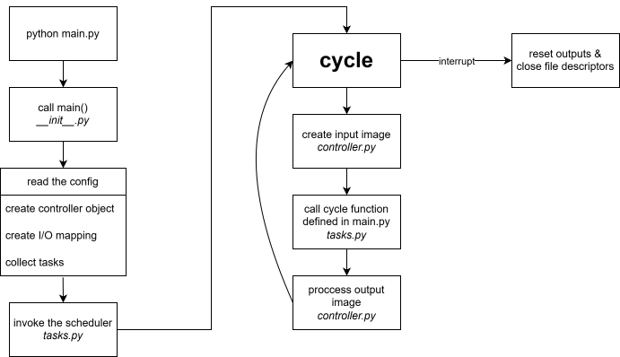

## Internal Architecture

This page describes the maintainer-facing internal structure of the `python-wagoplc` library. If you want to learn how to use the library in an application, start with the [User Guide](user-guide.md).

### Runtime architecture

What happens if you run `python main.py` at the command line? The following graphic illustrates the internal workflow.

At implementation level, the top-level `__init__.py` file contains the `main()` function. It is responsible for entering the library runtime, delegating configuration loading, constructing runtime objects, and starting the task execution cycle.

#### Configuration handling

The `read_config` module contains the configuration-loading path used by `main()`. It reads `controller.yaml`, interprets an optional `Tasks` instance from the script, and produces the unified runtime representation: variable mapping, `Controller` object, and `Task` instances. Invalid configuration is rejected during this stage, including schema validation of the `tasks` section via the [`schema` library](https://pypi.org/project/schema/).

#### Task management

Task management happens inside the `tasks` module, which contains the `Tasks`, `Task`, and `Scheduler` classes. The scheduler currently focuses on cyclic tasks. It runs until an external interrupt occurs, after which PLC outputs are reset and open file descriptors are closed.

#### Standard library

`python-wagoplc` contains a standard library of IEC 61131-3 style function blocks in the `fb` module. During configuration loading, `read_config` resolves function block definitions either from this standard library or from a user-defined module path.

#### Controller-specific functionality

At the heart of `python-wagoplc` are the packages that define controller-specific functionality. Each controller series has its own package, each controller its own module and class, and base implementations provide the common interface for follow-up variants where appropriate. The `CC100_v1` class and its subclasses are the main example of this structure.

### Source layout

- `src/wagoplc/__init__.py`: public entry points, including `main()`.
- `src/wagoplc/read_config.py`: configuration parsing, validation, and runtime object assembly.
- `src/wagoplc/tasks.py`: task definitions, scheduler logic, and signal handling.
- `src/wagoplc/controller.py`: generic controller and I/O abstractions.
- `src/wagoplc/fb.py`: standard function block implementations.
- `src/wagoplc/cc100/`: controller-family-specific implementations.

### When to use this page

Use this page when you are:

- extending the runtime or scheduler
- adding support for another controller variant
- debugging configuration assembly or task lifecycle issues
- tracing how public user-facing concepts map to internal modules

For contributor workflow, tests, and tooling, continue with the [Development Guide](development.md).
